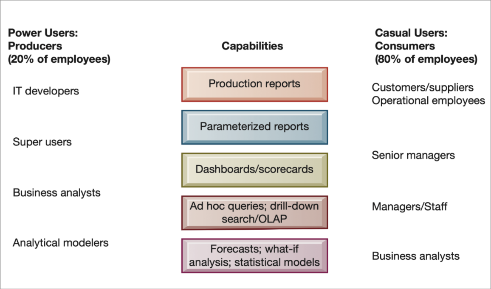
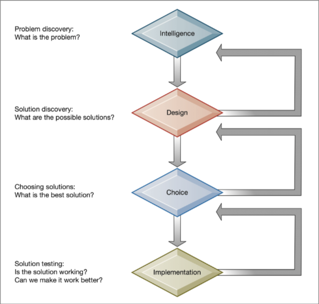
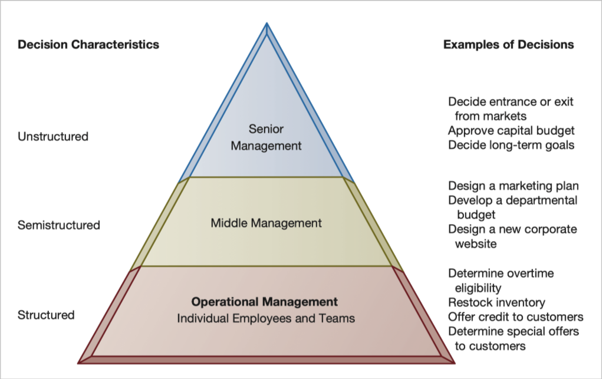
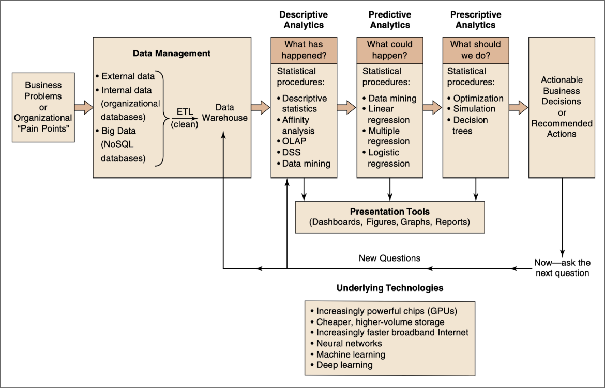
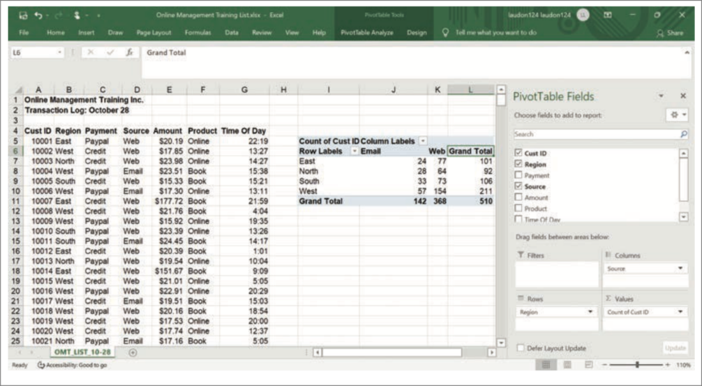
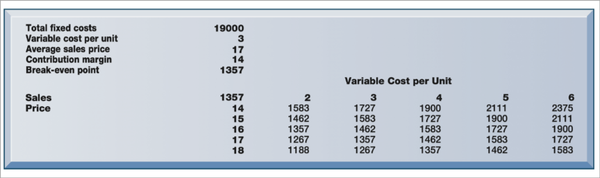
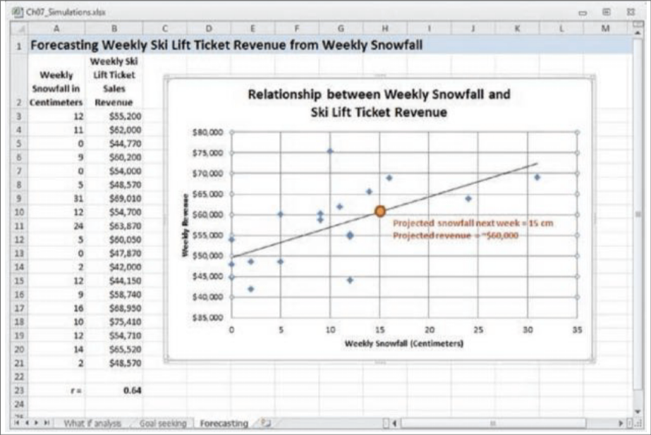

# Predavanje 2 (25. 2. 2026)

## Upravljanje podatkov

- IS podpirajo zajem, shranjevanje, analizo in interpretacijo podatkov
- Podatki -> info. -> znanje -> **prednost pred drugimi**
- **Baze podatkov** kot temelj IS
- Zahtevana je *visoka kakovost podatkov* (in jih je vedno *eksponentno* vec)
- Zaradi hitre rasti nastanejo **podatkovni silosi**
  (neorganizirani, nekategorizirani podatki)
- Vec virov: POS, splet, druzbena omrezja, senzorji
- S casom se podatki tudi starajo
- Legalnost zbiranja podatkov? -> ali jih lahko sploh zbiramo?

### Zakaj klub podatkom sprejemamo slabe odlocitve?

- Napacno opredenjen problem
- Napacna metrika/KPI (Key Performance indicator)
- pristranskost podatkov

### Datoteke vs. podatkovna baza

- Datotecni pristop: vsaka aplikacija ima svojo datoteko
  - Tezave: podvajanje, izolacija, nekonsistentnost
- Resitev: podatkovna baza
  - Prednosti: manj redundance, vecja integriteta in varnost
  - Slabost: kompleksnost + centralizacija (single-point failure)

### Hierarhija podatkov

- Bit: najmanjsa enota
- Byte: 8 bitov, en znak
- Polje: lastnost entitete
- Zapis: skupina povezanih polj
- Tabela: supina zapisov
- Podatkovna baza: skupina povezanih tabel

### Podatkovna skladisca in podrocna podatkovna skladisca

- Namen: analitika in odlocanje
- Podatkovna skladisca -> repozitorij *zgodovinskih podatkov*
- Podrocna podatkovna skladisca -> manjsa, oddelcna razlicica pod. sklad.
- Znacilnosti:
  - integrirano (na enem mestu)
  - casovno
  - nevolatilne (podatki se ne spreminjajo, samo dodajajo)
  - vecdimenzionalno (ena izmed dimenzij je cas),

## Upravljanje znanja

- sistematicno ravnanje z znanjem v organizaciji
- Tipi:
  - eksplicitno: zapisano, dokumentirano
  - tacitno: izkusnj, intuicija, praksa
- cilj: boslje odlocanje in prenos ekspertize
- Primer: SharePoint
  - Interna wiki platforma
  - Tukaj se hrani vse:
    - prakse, postopki, navodila, ...
    - profili s kompetencami
    - iskanje po kljucnih besedah
    - forumi
    - ...

## Poslovna analitika

- Primer: **Zillow**, zgresen trg
  - Podatki o nepremicninah -> **Zestimate**: oceni trzne vrednost nepremicnin
  - Prehod: *opisna* analitika -> **napovedna**
  - Cilj: napoved cen 3-6 mesecev vnaprej
  - Rezultat: **vec kot 500 mio. USD izgub**
  - **Problem?**: nepredvedljivost (COVID, sprememba zelja, pomanjkanje sile ...)
    - zato je algoritev konstantno *preplaceval*

### Podpora odlocanju z uporabo podatkov

- Poslovna analitika (angl. BA): razvoj ukrepov in priporocil na podlagi analize zgo. podatkov
- Uporablja statisticne metode, modele, analiticna orodja
- Vrste:
  - opisna: kaj se je zgodilo?
  - napovedna: kaj se bo zgodilo?
  - predpisna: kaj naj naredimo
- Cilj: prava informacija, pravemu odlocevalcu, pravocasna

### Kdo jo uporablja?

### Faze odlocanja

- Faze:
  1. Znanje
    - kaj je sploh problem
  2. Dizajn
    - kaksne resitve so na voljo
  3. Izbira 
    - trenutek odlocitve
    - casovni pritisk
  4. Implementacija
    - izvedba izbrane resitve
    - spemljanje delovanja
    - pogosto spregledamo
- Prve tri faze po navadi izvajajo algoritmi,
  vendar implementacijo pa mora imeti ze vedno vpliv cloveka

### Kdo potrebuje kaksne informacije

- Senior Management:
  - Podatki so agrigirani iz razlicnih virov
  - Odlocitev je vezana bolj na izkusnje
- Middle Management:
  - Nekaj informacij je strukturiranih
  - Potrebno je se vedno dobiti zunanje vire (sestanki, zunanji viri, ...)
- Operational Management:
  - Vecinoma strukturirane odlocitve
  - Velika avtomatiziranost -> Najvecja ugrozenost UI-ja

### Primer: UPS in tri vste analitike

- Opisna analitika: kje smo danes?
  - podatki o dostavah, sledenje paketom
  - Ucinek: Pregled na delovanju
- Napovedna analitika: Kaj se bo zgodilo?
  - napoved obremenitev in zamud
  - Ucinek: boljse planiranje
- Predpisna analitika: Kaj naj naredimo?
  - optimizacija poti, prilagoditve, minimizacija stroskov
  - Ucinek: financni prihranki

## Orodja za odlocanje

### Nadzorne plosce

- Vizualni prikaz KPI in CSF
- Hiter pregled v realnem casu (analiza trendov)
- Podpora odlocanju na vseh ravneh
- Moznost bolj podrobnega vida (Drill-down)

### Vrtilna tabela

- Hiter strukturiran prikaz, ki odgovorja na neko poslovno vprasanje

### Kaj-ce analiza

- Pregled vpliva podatkov na druge
  (spreminjamo en podatek in vidimo, kako se spreminjajo drugi)
- Vidimo tudi obcutljivost (pove, ali je odlocitev robusten ali krhek)

### Iskanje cilja (angl. Goalseeking)

- Nasprotno od kaj-ce
- Vprasamo se, kaj more biti nekaj (cena, koliko udelezencev na seminarju, ...),
  da se nam izide

### Napovedovanje

- Najdemo koleracijo z necem -> s tem napovedujemo
  npr. cena kart za smucanje glede na mm snega

### Ekspertni sistem

- Vnesemo nase podatke -> pridejo do odlocitve in jo **zagovarjajo**
- Odloca na podlagi nekih pravil

## UI pri odlocanju

### Pridobitve in tveganje

- Podpira: napovedovanje, priporocanje, razvrscanje
- Avtomatizacija, hitre odlocitve
- **Tveganje** -> pristranskost, netransparentnost, model drift, ...
- Pravilo: odgovornost in nadzor ostane pri organizaciji (clovek mora se vedno biti vkljucen)

### Uporaba na razlicnih podrocjih

- Marketing: priporocilni sistemi
- Finance: odkrivanje goljufij
- Operacije in logistika: optimizacija poti, napovedi
- HR: selekcija kandidatov
- Podpora strankam: chatbot, avtomatska obdelava zahtevkov
- Proizvodnja: nadzor kakovosti, napovedno vzdrzevanje
