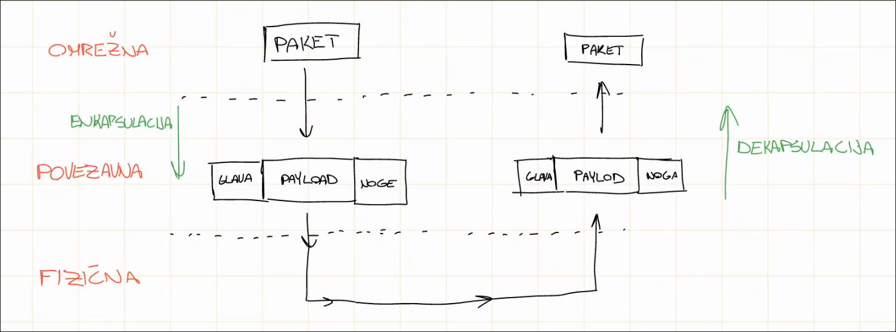
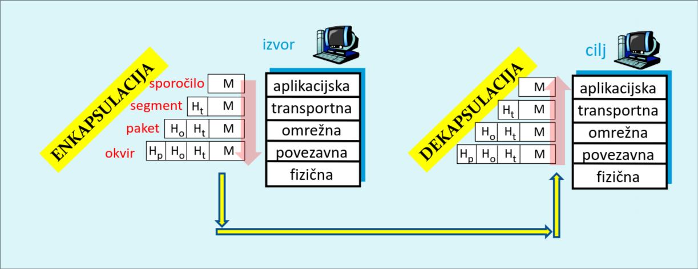
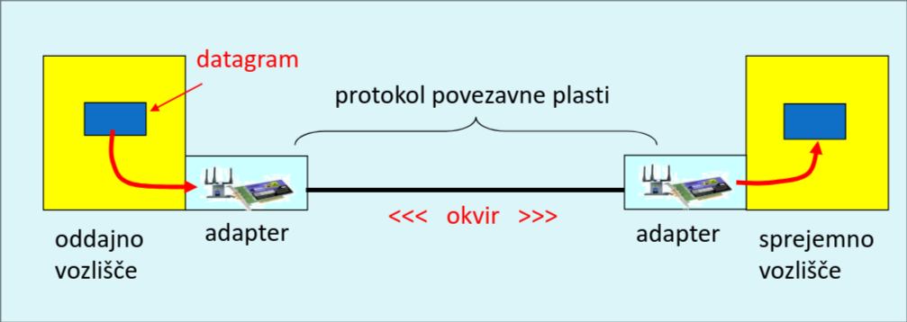
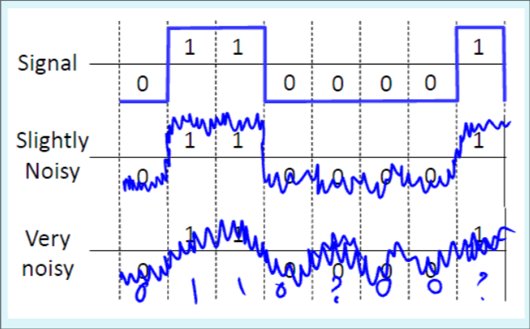
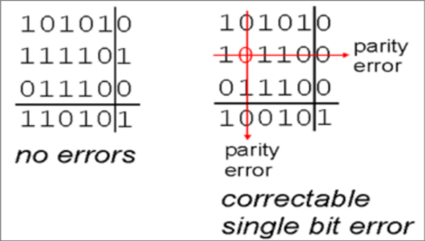
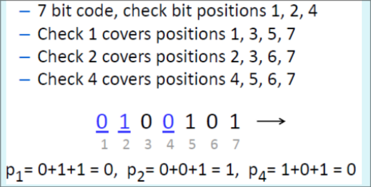
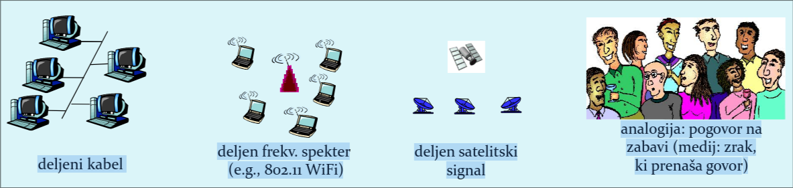
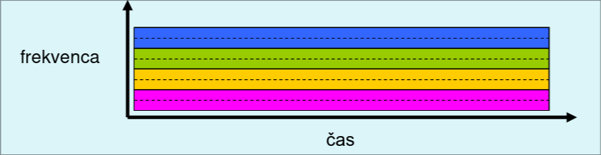
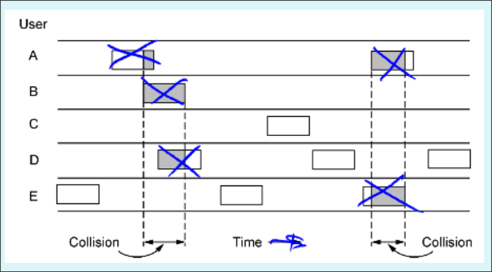
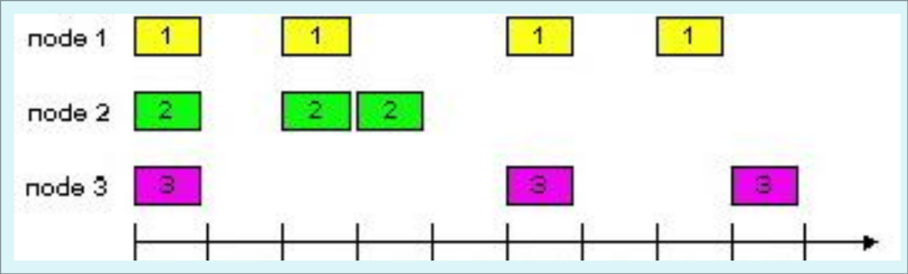

# Predavanje 1 (23. 2. 2026) {-}

- Ena visja od fizicne
- Prva plast, ki prejemnike/naslovnike ze naslavlja
  - Ti naslovi niso isto ko IP (logicni), ampak fizicni (doloceni z napravo)

- Enota -> **okvir** (*zaokrozena celota bitov*)
- Glavna naloga
  - prenos okvirja po povezavi med **sosednjima vozliscama (npr. racunalnik, usmerjevalnik)**,
    kjer upostevamo se tip medija

## Kaj **lahko (ampak ne rabi)** izvaja povezavna plast?

- okvirjanje datagramov
- zaznavanje in odpravljanje napak
- dostop do medija
- zagotavljanje zanesljive dostave
- kontrola pretoka

## Okvir

- "enota" na povezavni plasti
- opredeli zacetek in konec podatkov
- podatkom doda *glavo* (header) in *rep* (trailer), ki so potrebni za uspesen prenos

## Enkapsulacija in dekapsulacija

- Enkapsulacija: dodajanje glave (in mogoce noge) k trenutnem paketu,
  ko se premika **dol** skozi plasti. S tem je paket ovit
- Dekapsulacija: odstranjevanje glave (in noge) od paketa, da lahko pridemo do podatkov,
  ko se paket premika **gor** skozi plasti

## Implementacija povezavne plasti

## Zaznavanje in odpravljanje napak

- Zaradi suma je lahko tezko videti, ali je signal enako 0 ali 1

- Da lahko zaznavamo, dodamo dodatne *bite za preverjanje pravilnosti*
  (**EDC** - Error Detection Code)
  - Napake so se vedno mozne
  - Vec bitov -> vecja moznost zaznave

### Parnost
- Nacin za dolocenje EDC bitov
- Dodamo en *paritetni bit*
- Soda paritetna shema: 0 -> sodo stevilo enic, 1 -> liho stevilo enic
- Liha paritetna shema: 0 -> liha stevilo enic, 1 -> sodo stevilo enic
- **boljse pravilo**:
  - soda pariteta: stevilo enic skupaj z paritetnim bitom je *sodo*
  - liha pariteta: stevilo enic skupaj z paritetnim bitom je *liho*

- Problem? : ce se dva, stiri, ... biti pokvarijo, se pariteta ohrani in napaka ni zaznana

### Parnost v dveh dimenzijah

- Dodamo paritetni bit za vsako vrstico in vsak stolpec
- Posebni bit -> kumulativni bit ali meta-paritetni bit
  - sestejemo vse paritetne bite in jih glede na pariteto dolocimo se en bit

### Hemmingova koda

- Se en nacin za dolocanje EDC bitov
- Primer: podatek = 0101$_{(2)}$, moramo dodati 3 kontrolne bite
  - zakodiramo s sodo paritetno shemo (glede na to dolocamo bite)

- Prejemnik izracuna **sindrom** -> ce so v sindromu samo nicle, **ni** prislo do napake,
  drugace moramo popraviti bit, ki je na mestu enak sindromu
  - sindrom izracunamo tako, da sestejemo vrednosti tistih bitov (po modulu 2),
    ki smo jih uporabili pri dolocanju Hemmingovega bita
  - te bite zapisemo v nasprotnem vrstnem redu

## Protokoli z dostop do skupinskega medija

- Dve vrsti povezav:
  - dvotockovna: vsaka povezava ima le enega naslovnika in posiljatelja
  - oddajna: deljeni medij, vec vozlisc naenkrat

- Da lahko trke preprecimo, potrebujemo nek *protokol za koordinacijo dostopa*

- Za idealni protokol velja:
  1. Ce oddaja samo eno vozlisce, oddaja s hitrostjo R
     (eno vozlisce izkoristi celotno hitrost)
  2. Ce oddaja M vozlisc, oddajajo s povprecno hitrostjo R/M
     (vsak pride do svojega deleza)
  3. Protokol je decentriliziran
     (ni centralnega vozlisca, ki ga opravlja)
  4. Je enostaven

## Izogibanje in razresevanje kolizij

- Imamo 3 druzine protokolov:
  1. Delitev kanala (ni kolizij)
  2. Nakljucni dostop (so kolizije)
  3. Izmenicni dostop (ni kolizij)

### Delitev kanala

#### TDMA (Time Division Multiple Access)

- vsaka postaja dobi enak casovni interval (1 paket)

#### FDMA (Frequency Division Multiple Access)

- vsaka postaja dobi *svoj frekvencni pas*

### Protokoli za nakljucni dostop

- Dolocajo:
  - kako zaznati kolizijo in
  - kako z njo ravnati
- Postaja poslje kadar hoce in uporabi celotno hitrost kanala R
- Primeri:
  - ALOHA
  - razsekana ALOHA
  - CSMA, CSMA/CA, CSMA/CD

#### ALOHA

- Paket je vedno ranljiv
- Ce paket ne pride (**pride do kolizije**),
  je paket ponovno poslan po nekem nakljucnem casu
- Izkoristek/Prepustnost == **18%** (zelo slabo)

#### Razsekana ALOHA

- Cas razsekamo na dolocene casovne intervalne
  - Cas ni vec *zvezen* !!!
  - Vozlisca so *sinhronizirana*, vsa posiljajo na zacetku intervala
- Ce pride do kolizije -> okvir ponovno poslan v naslednjem intervalu z verjetnostjo `p`
- Izkoristek/Prepustnost == **37%** (zelo slabo)

